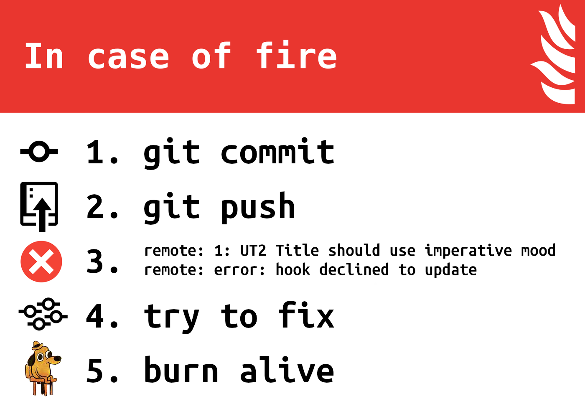
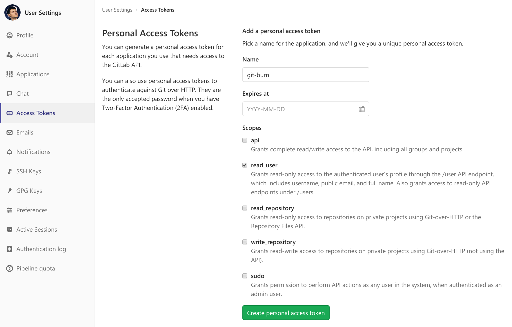

# Git Burn

[![Build status][travis-image]][travis-url]
[![Snap version][snap-image]][snap-url]
[![License][license-image]][license]

**Git Burn** is a server-side hook for linting commits.

[Features](#features) ·
[Install](#install) ·
[Integrations](#integrations) ·
[Copyright](#copyright)

## Features

- Highly opinionated, zero-configuration commit linter.
- Based on some [gitlint] rules.
- Checks the rules from the article «[How to Write a Git Commit Message]».
- Checks for issue references.
- Checks commit emails for presence in the user database. Only [GitLab] is supported now.

## Install

    snap install git-burn --classic

Note that you should have [snapd] installed.

### Set up hook with [GitLab]

To set a global hook for all repositories:

    install -dm 0755 -o git -g git /var/opt/gitlab/snap
    ln -fs "$(which git-burn)" /opt/gitlab/embedded/service/gitlab-shell/hooks/update.d

Please refer to [GitLab documentation on server-side hooks] for details.

## Integrations

### [GitLab] integration

Obtain GitLab personal access token first. Go to GitLab web interface → User Settings → Access Tokens. Give it a name like “`git-burn`”, check only “`read_user`” scope, and create a token.

Then just run on GitLab Shell machine:

    snap set git-burn gitlab.url="https://…" gitlab.token="…"

## Copyright

Copyright © 2018–2019 [Arthur Khashaev]. See [license] for details.

[Arthur Khashaev]: https://khashaev.ru
[license]: LICENSE.txt

[snapd]: https://snapcraft.io/docs/installing-snapd
[gitlint]: https://jorisroovers.github.io/gitlint/
[How to Write a Git Commit Message]: https://chris.beams.io/posts/git-commit/#seven-rules
[GitLab]: https://about.gitlab.com/
[GitLab documentation on server-side hooks]: https://docs.gitlab.com/ee/administration/custom_hooks.html

[travis-image]: https://travis-ci.com/Invizory/git-burn.svg
[travis-url]: https://travis-ci.com/Invizory/git-burn
[snap-image]: https://snapcraft.io/git-burn/badge.svg
[snap-url]: https://snapcraft.io/git-burn
[license-image]: https://img.shields.io/badge/license-MIT-green.svg
